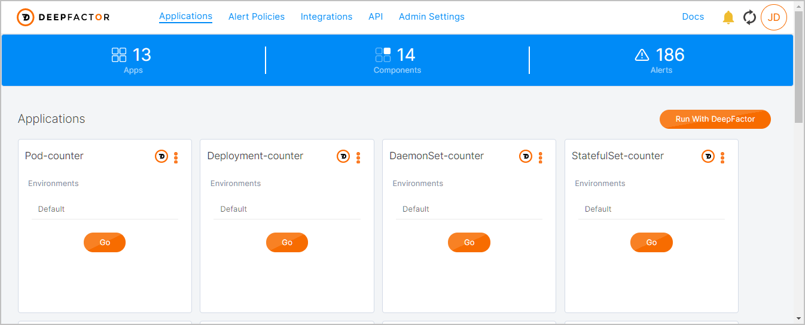
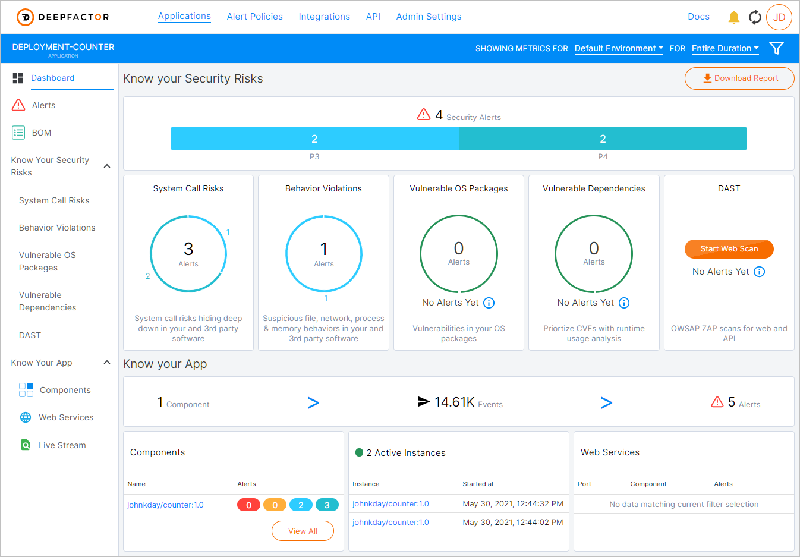
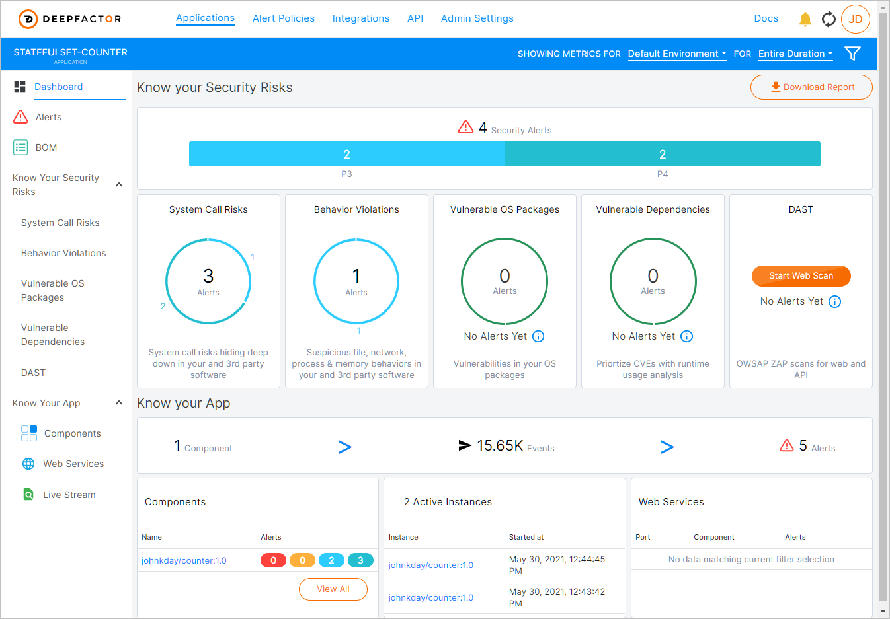
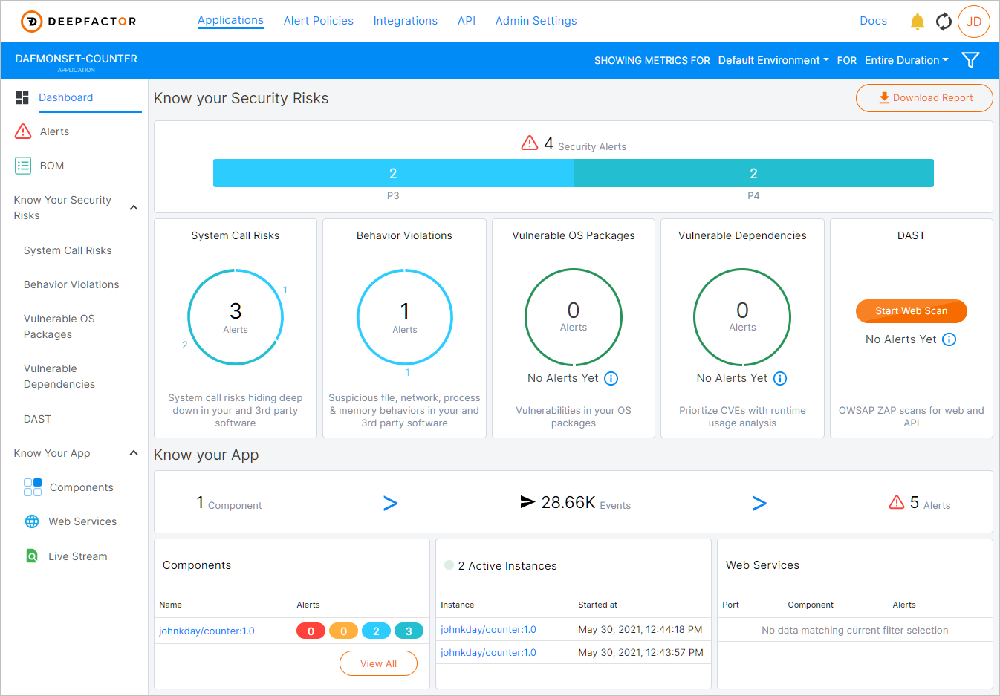

# Deepfactor Instrumentation of pods using different Kubernetes constructs

## Table of Contents
* [Construct](#Construct)
* [Requirements](#Requirements)
* [Deployment](#Deployment)
* [Results](#Results)
* [CleanUp](#CleanUp)
-------------------------------
<br><br>

### Construct
Kubernetes (K8s) yaml files are declared for 4 different constructs (workloads):
* [Pod](https://kubernetes.io/docs/concepts/workloads/pods/)
* [DeploymentSet](https://kubernetes.io/docs/concepts/workloads/controllers/deployment/)
* [StatefulSet](https://kubernetes.io/docs/concepts/workloads/controllers/statefulset/)
* [DaemonSet](https://kubernetes.io/docs/concepts/workloads/controllers/daemonset/)  

Aside from Pod yaml declaration, all of the other constructs deploy multiple
containers using the **`replicas`** value set at **`2`** or in the case of a DaemonSet 
a Pod will deploy on each worker node in the cluster.

Pod anti-affinity is also used to ensure that Pods are deployed on different
in the cluster.

Each of the declarations also include the use of a [PVC](https://kubernetes.io/docs/concepts/storage/persistent-volumes/#persistentvolumeclaims) (Persistent Volume Claim) using the
default class provided by the cluster. In this demo case the Longhorn [StorageClass](https://kubernetes.io/docs/concepts/storage/storage-classes/) is used as the default
class. This allows for creation of `ReadWriteOnce` as well as `ReadWriteMany`,
that is required for multiple pods to read/write to the volumes as needed by both
the DaemonSet and DeploymentSet.  
  
<br><br>  

### Requirements
To run a full test the following is required of the Kubernetes cluster:
* Running K8s version 1.18 (tested)
* DeepFactor webhook deployed to cluster
* Multiple worker nodes
* A default StorageClass can can create volumes with **`ReadWriteMany`** access
mode  
<br><br>

### Deployment

1. Clone repository from github.  
`git clone https://github.com/johnkday/DF-instrument-examples`
2. Change directory into **glibc** directory.   
`cd glibc`
3. Replace the **`<Your Token Here>`** in each of the `.yaml` files with
your own DeepFactor Run Token.  
`kubectl apply -f .`
4. Apply all of the workloads to the cluster.  
`kubectl apply -f .`
5. Watch the cluster deploy.  
`watch kubectl get all,pvc`
<br><br>

### Results
The pod `Init` to instrument with DeepFactor should occur for every pod and then
run appropriately by its intended design and should look something like:
<br>
```
NAME                                     READY   STATUS    RESTARTS   AGE
pod/daemon-counter-7z6zl                 1/1     Running   0          5m51s
pod/daemon-counter-w7kf9                 1/1     Running   0          5m51s
pod/deployment-counter-ff7b5c554-2b5sj   1/1     Running   0          5m51s
pod/deployment-counter-ff7b5c554-4mq7k   1/1     Running   0          5m51s
pod/pod-counter                          1/1     Running   0          5m51s
pod/statefulset-counter-0                1/1     Running   0          5m50s
pod/statefulset-counter-1                1/1     Running   0          4m37s

NAME                            DESIRED   CURRENT   READY   UP-TO-DATE   AVAILABLE   NODE SELECTOR   AGE
daemonset.apps/daemon-counter   2         2         2       2            2           <none>          5m51s

NAME                                 READY   UP-TO-DATE   AVAILABLE   AGE
deployment.apps/deployment-counter   2/2     2            2           5m51s

NAME                                           DESIRED   CURRENT   READY   AGE
replicaset.apps/deployment-counter-ff7b5c554   2         2         2       5m51s

NAME                                   READY   AGE
statefulset.apps/statefulset-counter   2/2     5m51s

NAME                                                              STATUS   VOLUME                                     CAPACITY   ACCESS MODES   STORAGECLASS   AGE
persistentvolumeclaim/daemon-counter                              Bound    pvc-b7b2ade7-97aa-41f0-9282-53b955c69c97   50Mi       RWX            longhorn       5m51s
persistentvolumeclaim/deployment-counter                          Bound    pvc-14cde128-169c-42f2-b673-6b1d839ce7b5   50Mi       RWX            longhorn       5m51s
persistentvolumeclaim/pod-counter                                 Bound    pvc-c3968da4-06fe-497e-97da-2e37284e0977   50Mi       RWX            longhorn       5m51s
persistentvolumeclaim/statefulset-counter-statefulset-counter-0   Bound    pvc-7bd089ba-73af-4e85-8e62-9cbab660a228   50Mi       RWO            longhorn       5m51s
persistentvolumeclaim/statefulset-counter-statefulset-counter-1   Bound    pvc-ed286011-8190-41cb-8674-aa9ac6b13737   50Mi       RWO            longhorn       4m37s
```
<br>
All of the DeepFactor alerts in the portal should be the same:
<br>

<br><br>

<br><br>

<br><br>

<br><br>

<br><br>

### CleanUp
<br>
1. Delete the setup using the command:  
`kubectl delete -f .`
2. StatefulSet volumes will not delete when they become unbound and therefore
must have an explict call to delete them
`kubectl get pvc -o name | xargs kubectl delete`
